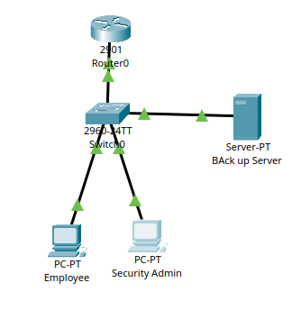
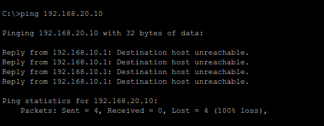
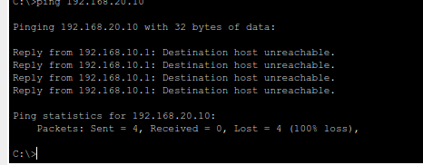

# Zero Trust Enterprise Network Simulation

## Overview

This Packet Tracer simulation demonstrates a segmented enterprise
network implementing Zero Trust security principles to reduce
ransomware lateral movement and isolate backup infrastructure.

The topology complements the ransomware resilience prototype by
showing how network segmentation and ACL enforcement protect
critical recovery systems.

---

# Network Topology

---

# VLAN Design

| VLAN | Purpose | Subnet |
|------|----------|--------|
| VLAN 10 | Employee Systems | 192.168.10.0/24 |
| VLAN 20 | Backup Server | 192.168.20.0/24 |
| VLAN 30 | Security Admin | 192.168.30.0/24 |

---

# Security Controls

## Implemented Features

- VLAN segmentation
- Router-on-a-stick inter-VLAN routing
- ACL-based access control
- Backup server isolation
- Admin-only recovery access
- Reduced ransomware lateral movement

---

# ACL Policy

Employee endpoints are denied direct access to the protected
backup server VLAN.

Only authorized administrative systems are permitted to access
recovery infrastructure.

---

# Functional Testing

| Test Case | Expected Result | Status |
|-----------|----------------|--------|
| Employee ↔ Employee | Allowed | PASS |
| Employee → Backup Server | Denied | PASS |
| Admin → Backup Server | Allowed | PASS |

---

# ACL Enforcement Test

Employee system access to backup infrastructure was successfully blocked.

---

# Authorized Admin Access

Administrative recovery access remained functional.

---

# Packet Simulation Validation

Simulation mode confirmed ACL-based packet filtering.

---

# Threat Scenario

## Simulated Ransomware Incident

1. Employee endpoint assumed compromised
2. Attempted access to backup infrastructure
3. ACL enforcement blocked communication
4. Backup server remained isolated
5. Administrative recovery workflow preserved

This demonstrates how segmentation limits ransomware spread
within enterprise environments.

---

# Technologies Used

- Cisco Packet Tracer
- VLANs
- ACLs
- Router-on-a-stick
- IPv4 subnetting

---

# Future Improvements

- NAT64 integration
- IDS/IPS simulation
- Syslog server integration
- Multi-site architecture
- VPN-secured administration
